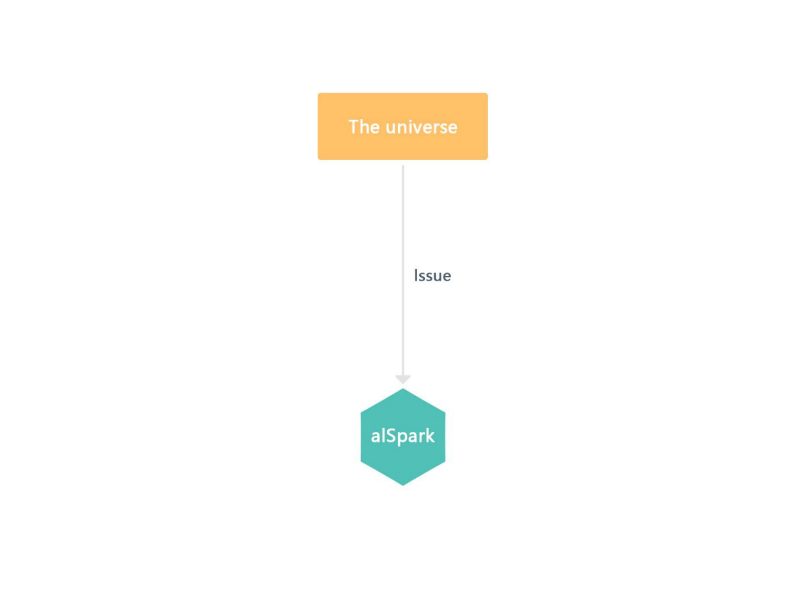

# alSpace

Metaverse is not a new concept at all. The idea of metaverse was already proposed by Neal Stephenson (a famous American science fiction writer) a long time ago. We agree with the idea that "the metaverse will be on the same stage as the mobile Internet". The concept of the metaverse is not yet precisely defined by modern science. This is a good thing for everyone because we can introduce more creative ideas into this uncharted territory.

The universe we want to create now must have the following characteristics. First, it must be able to bring a good experience for users, it is more of an ultimate enjoyment, players can have a healthy, pleasant, and comfortable environment to use. Second, it must be highly creative, we always carry out the idea that creativity can bring more possibilities, interesting ideas bring not only players a fun feeling, but also provide all the resources, planets and things in the universe that builders with the spirit of craftsmanship build, and we will seriously promote this idea to become a reality.

Experience, creativity, and craftsmanship will be the central theme of alSpace. It is not only our dream, but we have enough motivation and reasonable plans to accomplish it step by step in the future.

## **2.1 alBot**

alBot is a small intelligent robot with endless energy and possibilities, created by compiling the Alpha Matrix in the advanced alSpace through a divine cast with a unique genome and a naturally generated alSpark in the core of the universe. The body part is composed of a torso and seven parts, each with unique characteristics.

.png>)

There is a rigorous and closely related algorithm to alBot's ability value and form color in alSpace Its main content is that each alBot (whether it is a standard alBot or a super alBot) has 14 sets of gene sequences, which determine the physical characteristics and abilities of the alBot. In addition, the values of the gene sequences always conform to the regular distribution pattern, and in general, gene sequences with unique values are allowed to exist, but not in large numbers.

.png>)

Genetic sequences will appear in the universe world in the form of genomes. Each game in the universe can decide for itself the actual manifestation of these genomes and the value of their abilities. Alpha matrix can extract the genetic sequences from the alBot. This magical alBot will have different performances in different games; maybe in one game, one of its genetic sequences will be considered by players as moderate. In another game, players will consider its genetic series as superior because of different game ecology.

## **2.2 alSpark**

The alSpark is a valuable virtual currency in alSpace, which players can acquire by performing specific gameplay actions in the game. It is the origin of the birth of alBot, and each alBot needs alSpark to pass on its genes. In the chaotic stage of the universe, all the particles in the universe are in a state of extreme heat. The alSpark stabilizes the temperature of these particles and seems to give them the ability to combine at random. The random combination of particles allows miracles to occur, and one after another, alBot with infinite possibilities appears.

We hope that in alSpace, the developers of the universe will think about how they can profit and emphasize how to create a win-win situation for themselves and the players. In this entirely open economic universe, the benefit of the players will eventually benefit all the developers, and the key to winning or losing will open more channels for the players to benefit. Thus, the act of releasing the alSpark and recycling the alSpark will become a topic worthy of discussion by all.

## **2.3 Genome and Super alBot**

* Genomes can be divided into two types, standard genomes, and super genomes;
* These two genomes can also be used as NFT for trading;
* The alBot made up of the super genome is the super alBot.

****
